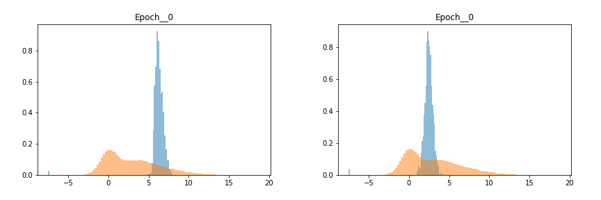

# Twin Auxiliary Classifier GAN

#### Requirements

* pytorch >=0.4.0
* torchvision ==0.2.0
* Jupyter Notebook

#### Datset 
* A distribution of 1D MoG having three overlapping mixture components with modes at 0, 3, 6, and 110, and standard
deviations of 1, 2, and 3, respectively.

#### Usage
* Run the Simple_GANs.ipynb to generate the results for vanilla GAN.
* For MAD-GAN run the Mad_GANs.ipynb to compare the results of vanillaGAN over MAD-GAN.
* Number of generater of MAD-GAN can by changing 'num_gen' and G.params(). 

#### Results

        [Left]: Result of Auxiliary Classifiers GAN                [Right]: Result of Twin Auxiliary Classifiers GAN

#### Todo List
- [ ] Implementing Projection cGAN.
- [ ] Implementing all the GANs with hinge loss.
- [ ] MMD evaluation for quantitative results.
- [ ] Experiments with CIFAR-100 and Overlapping MNIST

### Acknowledgements
* https://github.com/wiseodd

* Twin Auxiliary Classifiers GAN. Mingming Gong*, Yanwu Xu*, Chunyuan Li, Kun Zhang, and Kayhan Batmanghelich.
In Proceedings of 33rd Conference on Neural Information Processing Systems (NeurIPS 2019).(Spotlight).(https://arxiv.org/abs/1907.02690v2)
